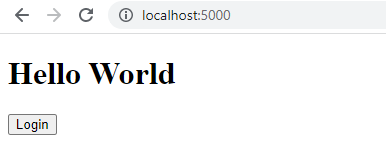
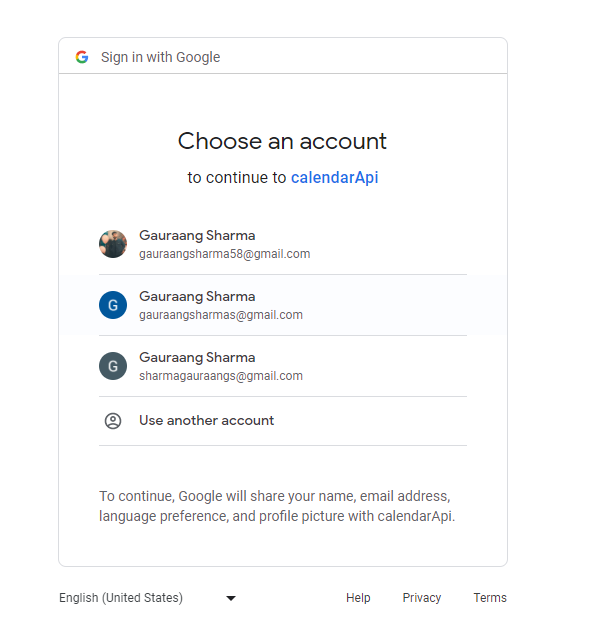
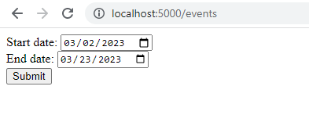
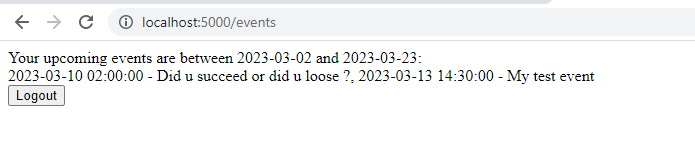
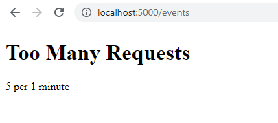
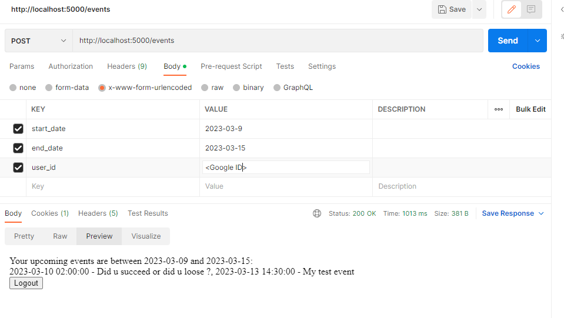
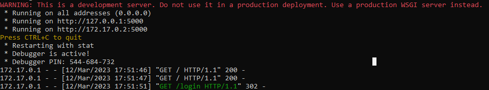

# Google Calendar API Integration with Python Flask
This project demonstrates how to build a Python Flask API that connects to Google Calendar API. Users can connect their Google calendar with this service, store user tokens in the database, and retrieve calendar events for a specific date range using those tokens.

# Installation
## MongoDB Setup
Before running the application, you need to have a MongoDB instance running. You can create a free instance on MongoDB Atlas.

### Schema
```
# Define MongoDB schema
user_schema = {
    'user_id': str,
    'credentials_data': dict,
    'credentials': str
}
```

## Google Cloud Console Setup
1. Create a project on the Google Cloud Console.
2. Create OAuth2 credentials for the project by following the steps and Enable the Google Calendar API for the project.
### First setup a OAuth Screen
  - Keep user type external
  - You can keep the app domain, and the Authorized domain sections empty
  - Click on ADD or remove scopes: and select: 
    ```
    https://www.googleapis.com/auth/calendar
    ```
  - In Test Users add your email id
### Setup credentials
  - create new credentials
  - Select OAuth client ID
  - In Applicatio type select web application
  - Under Authorized JavaScript origins add:
  ```
  http://localhost:5000
  ```
  - Under Authorized redirect URIs add:
  ```
  http://localhost:5000/callback
  ```
3. Download the client_secret.json file

## Setup Using Docker
1. Clone this repository using git clone https://github.com/<your-username>/google-calendar-api.git
2. Navigate to the cloned repository
3. Build a docker image using 
  ```
  docker build -t meet:1.0.0 .
  ```
4. Run the docker image using the following command:
  ```
  docker run -p 5000:5000 \
  -e MONGO_URI=<your-mongodb-connection-string> \
  -e MONGO_DB=<your-mongodb-database> \
  -e MONGO_COLLECTION=<your-mongodb-collection> \
  -e GOOGLE_CLIENT_ID=<your-google-client-id> \
  -e CLIENT_SECRET=<your-google-client-secret> \
  meet:1.0.0
  ```
  ### Note: Here MongoDB uri should be url encoded, and if there's a & symbol, it should come in "", also the CLIENT_SECRET recieves the json data of your client_secret.jsom file, wrapped in single inverted commas ''.
5. Access the application by visiting http://localhost:5000 on your web browser.

## Setup on Local Device
1. Clone this repository using git clone https://github.com/<your-username>/google-calendar-api.git
2. Navigate to the cloned repository using cd google-calendar-api
3. Create a Python virtual environment using python -m venv env
4. Activate the environment using source env/bin/activate (Linux/Mac) or env\Scripts\activate (Windows)
5. Install the dependencies using pip install -r requirements.txt
6. Create a .env file in the app directory with the following environment variables:
  ```
  GOOGLE_CLIENT_SECRET=<your-google-client-secret>
  GOOGLE_CLIENT_ID=<your-google-client-id>
  MONGO_URI=<your-mongodb-connection-string>
  MONGO_DB=<your-mongodb-database>
  MONGO_COLLECTION=<your-mongodb-collection>
  CLIENT_SECRET=<your-google-client-secret-json>
  ```
 ### Note: Here MongoDB uri should be url encoded, and if there's a & symbol, it should come in "", also the CLIENT_SECRET recieves the json data of your client_secret.jsom file, wrapped in single inverted commas ''.
 
7. Start the application using 
  ```
  flask run
  ```
8. Access the application by visiting http://localhost:5000 on your web browser.

## Usage
### Routes

/: Home page
/login: Login using Google OAuth2
/logout: Clears the session
/events (GET): Page to select the dates
/events (POST): Pass in start_date, end_date, and user_id (Your Google ID)

## Features
- Uses Flask-Limiter to limit the number of requests. The /events route is limited to 5 requests per minute for testing purposes.
- Uses refresh_token to automatically refresh the tokens. If the refresh_token is expired, the user is redirected to the sign-in page.

## Usage screenshots
1. Index page



2. OAuth page



3. Events range page



4. Events result page | Post request



5. Limit handling



6. Postman post request



7. Docker hosted 




